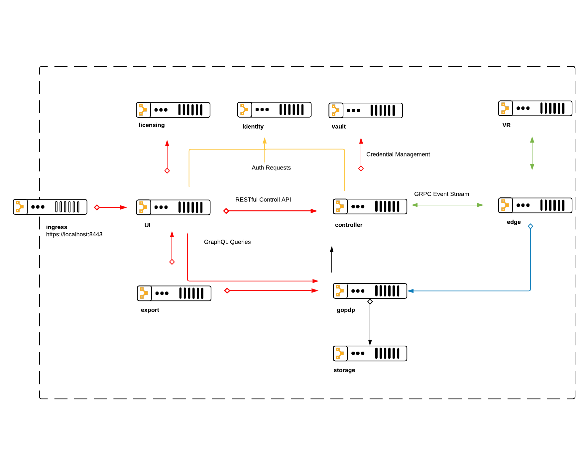

# Architecture GH DESKTOP

Puppet Remediate consists of a number of components and services, each one running as an individual Docker container.

|Service|Container|Description|
|-------|---------|-----------|
|Licensing|`remediate_licensing`|Stores the user licensing information and is queried by the UI using the licensing API.|
|Ingress|`remediate_frontdoor`|The nginx front end listening on port 8443 \(HTTPS\).|
|VR|`remediate_vr`|Connects to and retrieves host and vulnerability data from Tenable, Qualys and Rapid7.|
|Storage|`remediate_storage`|The storage layer for discovered data which communicates with the `remediate_gopdp` container on port 5432.|
|Identity|`remediate_identity`|Generates the bearer token for the default user roles: `admin` and `viewer`.|
|Export|`remediate_export`|The export service consumes API requests from the UI on port 9200 \(HTTPS\) and queries the data platform on port 8082 \(GRPC\).|
|gopdp|`remediate_gopdp`|The data platform is an ingest service implementation that processes discovered data from the edge on port 8082 \(GRPC\), and exposes the query API to the UI on port 8084.|
|Controller|`remediate_controller`|The controller manages the discovery process by:-   Authenticating each API request by validating the bearer token with remediate\_identity on port 5556 \(HTTPS\).

-   Retrieving source and host credentials from the vault on port 8200 \(HTTPS\).

-   Consuming the discovery and task API requests from the UI on port 9999 \(HTTPS\).

-   Dispatching discovery and task commands to the edge on port 8081 \(GRPC\).

|
|Edge|`remediate_edge`|The edge consumes the discovery API requests from the controller and invokes each source the user adds. It discovers vulnerabilities, resources, executes ad hoc tasks on target hosts, and submits data to the data platform. The edge services consist of a set of pluggable providers that are determined by which sources are added.|
|Vault|`remediate_vault`|The secure store for source and node credentials.|
|UI|`remediate_ui`|The UI enables you to add sources, credentials, and run tasks on target hosts by initiating discovery API requests to the controller on port 9999 \(HTTPS\). To populate the dashboards and provide a high-level summary view of your infrastructure, the UI queries the data platform on port 8084 \(HTTPS\) for vulnerabilities and discovered resources.|

**Parent topic:**[Installing Remediate](installing_remediate.md)

